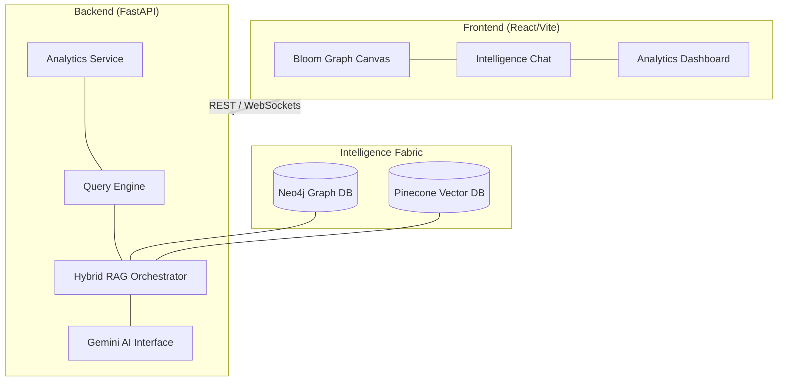

# Vidzai: Enterprise Intelligence Platform with Hybrid RAG

<div align="center">

<!-- Badge Section -->


**Transform Unstructured Enterprise Data into Intelligent Forensic Knowledge Graphs**

[Features](#-key-features) • [Architecture](#-architecture) • [Quick Start](#-quick-start) • [Documentation](#-detailed-usage-guide) • [License](#-license)

</div>

---

## 🎯 About Vidzai

**Vidzai** is an enterprise-grade intelligence platform that revolutionizes how organizations extract insights from massive volumes of unstructured data. By combining **Large Language Models (Gemini 3 Flash)**, **Knowledge Graphs (Neo4j)**, and **Vector Retrieval (Pinecone)**, Vidzai transforms raw email communications into a sophisticated, queryable knowledge base.

### The Problem
- **Unstructured data chaos**: Enterprise communications are scattered across emails with no coherent structure.
- **Knowledge silos**: Critical business intelligence is locked within unorganized documents.
- **Slow insight extraction**: Traditional methods struggle to connect entities and relationships at scale.

### The Solution
Vidzai leverages a **Hybrid RAG (Retrieval-Augmented Generation)** architecture that:
1. **Extracts intelligence** using Google Gemini AI for Named Entity Recognition (NER).
2. **Structures knowledge** in a Neo4j graph database with entity relationships.
3. **Enables semantic search** via Pinecone vector embeddings.
4. **Synthesizes insights** through an intelligent chat interface powered by LLM context fusion.

---

## 🌟 Key Features

### 🔍 Bloom Forensic Graph Engine
- **Interactive High-Fidelity Canvas**: Powered by `@neo4j-nvl`, featuring real-time node highlighting and relationship pathing.
- **Probe vs. Global Modes**: Toggle between contextual subgraphs (Probe) and full enterprise constellation views (Global).
- **Intuitive Inspectors**: Deep-dive into behavioral metrics, forensic metadata, and entity identities.

### 🤖 Intelligent Investigation Chat
- **Hybrid Retrieval**: Synthesis of insights from both Graph (Neo4j) and Vector (Pinecone) stores.
- **Thought Stepper**: Transparent AI reasoning process showing the investigation path.
- **Multi-turn Context**: Intelligent memory that understands previous queries and graph states.

### 📊 Cognitive Analytics Dashboard
- **Flux Charts**: Real-time visualization of entity distributions and communication patterns via Recharts.
- **KPI Fabric**: Critical metrics for data throughput, extraction health, and anomaly detection.
- **Intelligence Alerts**: Real-time forensic signal broadcasting via WebSocket for immediate situational awareness.

### ⚖️ Forensic Curation Protocol
- **Three-Tiered Triage**: Unified protocol supporting `Validated Intel`, `Flagged Anomaly`, and `Severe Risk` states.
- **Actionable Metadata**: High-density investigative forms that persist status and metadata directly into the graph.
- **Persistence Layer**: Seamless integration with Neo4j for storage and stateful forensic history.

### 🏗️ Enterprise Backend Architecture
- **FastAPI Engine**: High-performance, production-grade async service.
- **Scalable Ingestion**: End-to-end data processing from raw emails to structured knowledge.
- **Checkpointing**: In-built recovery for long-running extraction jobs.

---

## 🛠️ Technology Stack

### Frontend
| Technology | Version | Purpose |
|-----------|---------|---------|
| **React** | 19 | Modern UI library with hooks |
| **Vite** | 8.0 | Lightning-fast build tool |
| **Tailwind CSS** | 4.2 | Utility-first styling (Glassmorphism) |
| **Framer Motion** | 12.38 | High-fidelity animations |
| **Neo4j NVL** | 2.10 | Native graph visualization engine |
| **Zustand** | 5.0 | Atomic state management |

### Backend
| Technology | Version | Purpose |
|-----------|---------|---------|
| **FastAPI** | 0.95+ | High-performance async API |
| **Pydantic** | 2.0+ | Data validation & settings |
| **Neo4j Driver** | 5.x | High-performance graph traversal |
| **Pinecone SDK** | 3.x | Vector similarity search |
| **Google GenAI** | 3.1 Flash | LLM for extraction and synthesis |

---

## 🏗️ Architecture

### System Diagram


### Data Processing Pipeline (The "Miles" Series)
1. **Miles1** (`miles1.ipynb`): Data preprocessing & enrichment.
   - Enron corpus ingestion with multi-encoding recovery.
   - Multi-stage email body cleaning.
   - Feature engineering (word counts, time-of-day, topic categories).

2. **Miles2** (`miles2extract_ent_rel.ipynb`): AI intelligence extraction.
   - Named Entity Recognition (NER) using Gemini 3 Flash.
   - Semantic relationship extraction.
   - Output: Structured entity & relationship triples.

3. **Miles3** (`miles3hybridRAG.py`): Knowledge synthesis.
   - Hybrid search combining graph & vector retrieval.
   - LLM-powered answer generation.
   - Interactive querying interface.

---

## 🚀 Quick Start

### 1. Prerequisites
- **Python** 3.10 or higher
- **Node.js** 18 or higher
- **Neo4j Database** (Local or AuraDB)
- **Pinecone Account** (1024-dim, cosine metric)
- **Google Gemini API Key**

### 2. Installation

#### Clone the Repository
```bash
git clone https://github.com/Juxtpawan/AI-based-Knowledge-Graph-Builder-for-Enterprise-Intelligence.git
cd AI-based-Knowledge-Graph-Builder-for-Enterprise-Intelligence
```

#### Backend Setup
```bash
cd backend
python -m venv .venv
# Activate: .\.venv\Scripts\activate (Windows) or source .venv/bin/activate (Unix)
pip install -r requirements.txt
```

#### Frontend Setup
```bash
cd ../frontend
npm install
```

### 3. Configuration
Create a `.env` file in the `backend/` directory:
```env
NEO4J_URI=bolt://localhost:7687
NEO4J_USER=neo4j
NEO4J_PASSWORD=your_password
PINECONE_API_KEY=your_key
PINECONE_INDEX_NAME=email-knowledge-graph
GEMINI_AI_API_KEY=your_key
```

### 4. Run the Project
**Recommended (One-Click):**
```powershell
.\start_project.ps1
```

**Manual Execution:**
- **Terminal 1 (Backend):** `cd backend && python main.py`
- **Terminal 2 (Frontend):** `cd frontend && npm run dev`

---

## 📂 Project Structure

```
AI-based-Knowledge-Graph-Builder-for-Enterprise-Intelligence/
├── README.md                           # Main documentation
├── LICENSE                             # MIT License
├── backend/                            # FastAPI Intelligence Layer
│   ├── main.py                         # API entry point
│   ├── miles3hybridRAG.py              # Hybrid RAG Orchestrator
│   ├── api/routers/                    # Segmented domain logic
│   ├── models/                         # Pydantic schemas
│   ├── notebooks/                      # The Miles extraction series
│   └── logs/                           # Forensic processing logs
├── frontend/                           # React Visualization Layer
│   ├── src/
│   │   ├── components/graph/           # Bloom engine components
│   │   ├── components/chat/            # Intelligence Chat
│   │   ├── store/                      # Zustand state store
│   │   └── pages/                      # Client-side views
├── data/                               # Dataset repository
│   ├── kg_data/                        # Knowledge graph triples
│   └── processed/                      # Cleaned corpora
└── .gitignore                          # Project ignore rules
```

---

## 📚 Detailed Usage Guide

### Data Pipeline Workflow

#### Step 1: Prepare & Enrich Data
Open and run `backend/notebooks/miles1.ipynb`:
- Ingests raw email corpus.
- Applies multi-stage cleaning and encoding recovery.
- Generates analytical features like word counts and time-of-day.

#### Step 2: Extract AI Intelligence
Open and run `backend/notebooks/miles2extract_ent_rel.ipynb`:
- Uses Gemini 3 Flash for NER.
- Extracts entities (Person, Org, Location) and semantic relationship patterns.

#### Step 3: Build Knowledge Graph
Open and run `backend/notebooks/miles2neo4j_storage.ipynb`:
- Transforms structured triples into a 6-layer Neo4j graph architecture.
- Maps identity profiles, communication backbones, and intelligence trails.

#### Step 4: Query with Hybrid RAG
Run `backend/main.py` and use the chat interface to ask natural language questions. The system synthesizes answers through joint vector and graph retrieval.

### Performance Optimization
- **Batch Processing**: Use `extraction_checkpoint.json` for long extraction jobs.
- **Database Tuning**: Add Neo4j indexes on `name` and `email` properties.
- **Vector Search**: Pinecone configuration using cosine similarity for 1024-dim embeddings.

---

## 🔧 Configuration & Troubleshooting
| Issue | Solution |
|-------|----------|
| `ModuleNotFoundError` | Run `pip install -r requirements.txt` in active venv |
| Neo4j connection refused| Ensure Neo4j service is running; check bolt URI |
| Slow query responses | Optimized indexes needed; check Neo4j query plan |
| CORS errors | Verify backend allowed origins in `main.py` |

---

## ⚖️ License
Distributed under the **MIT License**. See [LICENSE](LICENSE) for details.

---

<div align="center">

Developed with ❤️ for enterprise intelligence by [Pawan Sharma](https://github.com/Juxtpawan)

**⭐ If you find this project helpful, please star it!**

</div>
