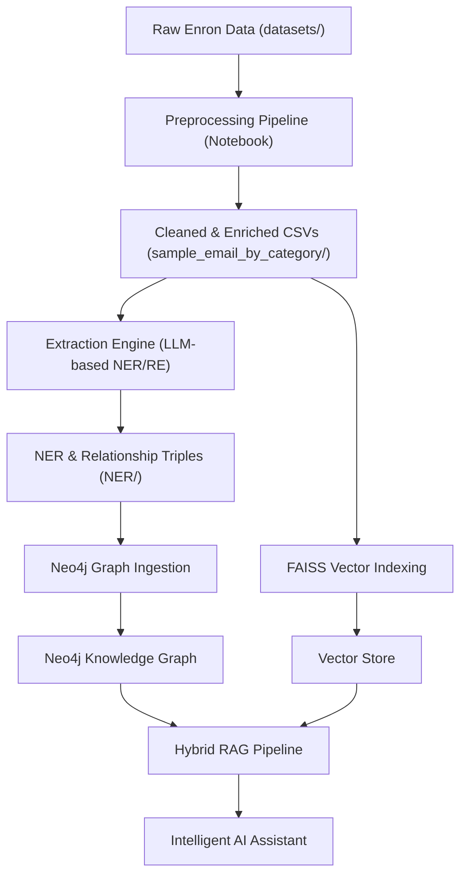

# AI-based Knowledge Graph Builder for Enterprise Intelligence

This project is a comprehensive pipeline designed to transform unstructured enterprise data (like the Enron email corpus) into a structured Knowledge Graph and a Hybrid RAG (Retrieval-Augmented Generation) system. 

It combines advanced NLP, Graph Databases (Neo4j), and LLMs (Gemini/Groq) to provide deep insights into corporate communication, entities, and relationships.

## 🗺️ Architectural Overview

The following diagram shows the end-to-end flow from raw data to an intelligent AI assistant:



---

## 🚀 Core Components

### 1. Preprocessing Pipeline (`preprocess_pipeline.ipynb`)
Handles initial data ingestion, multi-encoding recovery, and 3-layer body cleaning (removing markers, quotes, and boilerplate). It produces the enriched datasets found in `sample_email_by_category/`.

### 2. Extraction Engine (`extraction_engine.py`)
Uses LLMs (Google Gemini or Groq) to perform high-precision Named Entity Recognition (NER) and Relationship Extraction (RE). It parses cleaned emails into structured triples.

### 3. Neo4j Storage (`neo4j_storage.py`)
Orchestrates the ingestion of people, metrics, emails, and extracted triples into a Neo4j Graph Database. It establishes complex relationships like `SENT`, `TO`, `WORKS_FOR`, and `RELATED_TO`.

### 4. Hybrid RAG Pipeline (`rag_pipeline.py`)
The final intelligence layer that combines:
- **Semantic Search**: FAISS vector search over cleaned email bodies.
- **Structured Retrieval**: Cypher queries against the Neo4j Knowledge Graph.
- **Answer Generation**: Gemini-powered synthesis of both contexts to answer user queries accurately.

---

## ⚡ Getting Started

### 1. Prerequisites
- **Python 3.10+**
- **Neo4j Database** (Local or Aura)
- **API Keys**: Google Gemini (GEMINI_AI_API_KEY) and/or Groq (GROQ_API_KEY).

### 2. Setup Environment
```bash
git clone https://github.com/Juxtpawan/AI-based-Knowledge-Graph-Builder-for-Enterprise-Intelligence.git
cd AI-based-Knowledge-Graph-Builder-for-Enterprise-Intelligence
python -m venv .venv
# Windows
.venv\Scripts\activate
# Install deps
pip install -r requirements.txt
```

### 3. Configuration
Create a `.env` file in the root directory:
```env
NEO4J_URI=bolt://localhost:7687
NEO4J_USER=neo4j
NEO4J_PASSWORD=your_password
GEMINI_AI_API_KEY=your_gemini_key
```

### 4. Run the Pipeline
1. **Extract Knowledge**:
   ```bash
   python extraction_engine.py
   ```
2. **Ingest to Graph**:
   ```bash
   python neo4j_storage.py
   ```
3. **Build Vector Index**:
   ```bash
   python rag_pipeline.py --build
   ```
4. **Query the System**:
   ```bash
   python rag_pipeline.py --query "Who was involved in the California power crisis?"
   ```

---

## 📂 Project Structure
- `rag_pipeline.py`: Main entry point for Hybrid RAG.
- `neo4j_storage.py`: Neo4j ingestion logic.
- `extraction_engine.py`: LLM-based entity and relationship extractor.
- `sample_email_by_category/`: The core cleaned dataset.
- `NER/`: Extracted knowledge triples (Entities and Relationships).
- `datasets/`: Raw input CSVs (ignored by git).
- `final_datasets/`: Intermediate preprocessing results.
