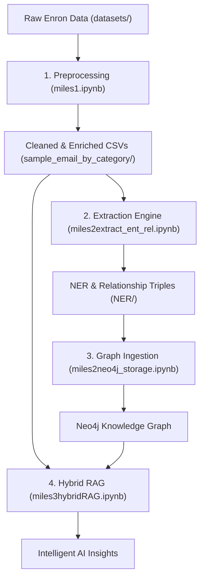

# AI-based Knowledge Graph Builder for Enterprise Intelligence

This project is a comprehensive pipeline designed to transform unstructured enterprise data (like the Enron email corpus) into a structured Knowledge Graph and a Hybrid RAG (Retrieval-Augmented Generation) system. 

It combines advanced NLP, Graph Databases (Neo4j), Vector Databases (Pinecone), and LLMs (Gemini) to provide deep insights into corporate communication, entities, and relationships.

## 🗺️ Architectural Overview

The following diagram shows the end-to-end flow from raw data to an intelligent AI assistant:



---

## 🚀 Core Components

### 1. Data Processing & Enrichment (`miles1.ipynb`)
Handles initial data ingestion from the raw Enron corpus, multi-encoding recovery, and a multi-stage body cleaning process. It generates analytical features like word counts, time-of-day categories, and initial topic classifications.

### 2. AI Intelligence Layer (`miles2extract_ent_rel.ipynb`)
The "brain" of the extraction process. It uses LLMs (Gemini 3.1 Flash Lite) to exhaustively extract Named Entities and Semantic Relationships from cleaned emails, producing structured knowledge triples.

### 3. Graph Ingestion & Storage (`miles2neo4j_storage.ipynb`)
Orchestrates the transformation of processed CSVs into a 6-layer Neo4j Knowledge Graph. It builds the identity profiles, communication backbone, and integrates the AI-extracted triples.

### 4. Hybrid RAG Exploration (`miles3hybridRAG.ipynb`)
The final intelligence layer that combines semantic vector search and structured graph retrieval. It allows for interactive querying of the Knowledge Graph and Vector store within a notebook environment.

---

## ⚡ Getting Started

### 1. Prerequisites
- **Python 3.10+**
- **Neo4j Database** (Local or Aura)
- **Pinecone Account** (For vector storage)
- **API Keys**: 
    - `GEMINI_AI_API_KEY` (Google AI)
    - `PINECONE_API_KEY` (Pinecone)

### 2. Setup Environment
```bash
git clone https://github.com/Juxtpawan/AI-based-Knowledge-Graph-Builder-for-Enterprise-Intelligence.git
cd AI-based-Knowledge-Graph-Builder-for-Enterprise-Intelligence
python -m venv .venv

# Windows
.venv\Scripts\activate

# Install dependencies
pip install -r requirements.txt
```

### 3. Configuration
Create a `.env` file in the root directory:
```env
NEO4J_URI=bolt://localhost:7687
NEO4J_USER=neo4j
NEO4J_PASSWORD=your_password

GEMINI_AI_API_KEY=your_gemini_key
PINECONE_API_KEY=your_pinecone_key
```

1. **Prepare Data & Enrich**:
   Run `miles1.ipynb` to process raw data.
2. **Extract AI Intelligence**:
   Run `miles2extract_ent_rel.ipynb` to generate NER and Relationship triples.
3. **Build Knowledge Graph**:
   Run `miles2neo4j_storage.ipynb` to ingest data into Neo4j.
4. **Hybrid RAG Querying**:
   Use `miles3hybridRAG.py` to perform complex queries using Vector and Graph context.

---

## 📂 Project Structure

### 📓 Notebooks (The "Miles" Series)
- `miles1.ipynb`: Data ingestion, cleaning, and enrichment.
- `miles2extract_ent_rel.ipynb`: AI-driven entity and relationship extraction.
- `miles2neo4j_storage.ipynb`: Knowledge Graph construction in Neo4j.
- `miles3hybridRAG.py`: Interactive Hybrid RAG development.

### 📊 Data & Knowledge
- `sample_email_by_category/`: Core cleaned and enriched dataset (CSV).
- `NER/`: Structured intelligence triples (Entities & Relationships).
- `final_datasets/`: Intermediate processed datasets.
- `datasets/`: Raw input CSVs (Enron corpus).
- `logs/`: Pipeline execution logs.
